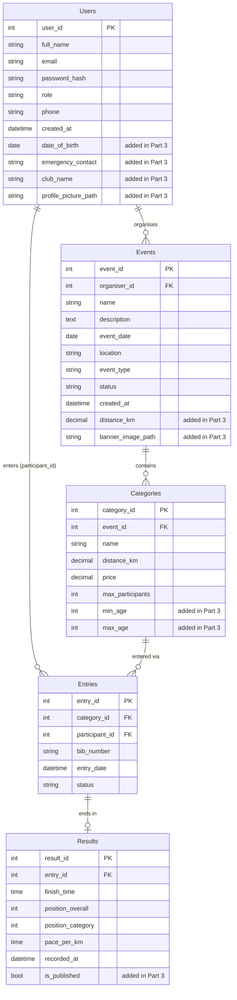

# ERD (matches the real RaceDayDB after docs/part3_upgrade.sql)
Paste into https://mermaid.live and export a PNG for the /docs folder, or compare with your own Part 1 ERD.

```mermaid
erDiagram
    Users ||--o{ Events : organises
    Events ||--o{ Categories : contains
    Users ||--o{ Entries : "enters (participant_id)"
    Categories ||--o{ Entries : "entered via"
    Entries ||--o| Results : "ends in"
    Users { int user_id PK
            string full_name
            string email
            string password_hash
            string role
            string phone
            datetime created_at
            date date_of_birth "added in Part 3"
            string emergency_contact "added in Part 3"
            string club_name "added in Part 3"
            string profile_picture_path "added in Part 3" }
    Events { int event_id PK
            int organiser_id FK
            string name
            text description
            date event_date
            string location
            string event_type
            string status
            datetime created_at
            decimal distance_km "added in Part 3"
            string banner_image_path "added in Part 3" }
    Categories { int category_id PK
            int event_id FK
            string name
            decimal distance_km
            decimal price
            int max_participants
            int min_age "added in Part 3"
            int max_age "added in Part 3" }
    Entries { int entry_id PK
            int category_id FK
            int participant_id FK
            string bib_number
            datetime entry_date
            string status }
    Results { int result_id PK
            int entry_id FK
            time finish_time
            int position_overall
            int position_category
            time pace_per_km
            datetime recorded_at
            bool is_published "added in Part 3" }
```
